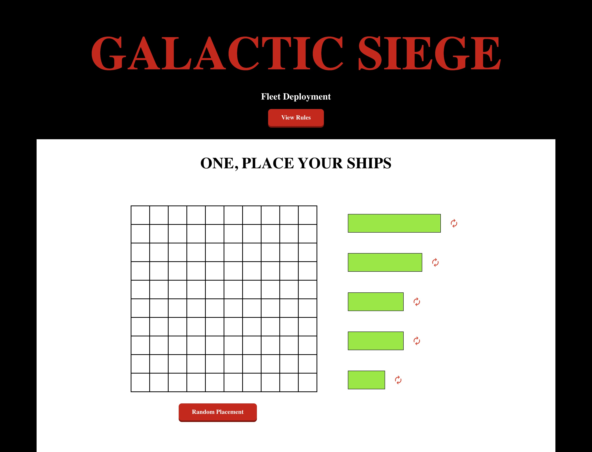

# Galactic Siege - A Battleship Game

A modern, web-based implementation of the classic Battleship board game, built with vanilla JavaScript, HTML, and CSS. This project was completed as part of The Odin Project's curriculum.

**Live Demo:** [Link to live demo](https://ayoroq.github.io/battleship/)



## Features

- **Two Game Modes:**
  - **Single Player:** Test your skills against a computer AI.
  - **Local Multiplayer:** Play against a friend on the same device with a "pass the device" screen to keep boards hidden.
- **Interactive Ship Placement:**
  - Drag and drop your fleet onto the board.
  - Double-click ships on the grid to rotate them.
  - Click the "Random Placement" button for a quick setup.
- **Engaging Gameplay:**
  - Clean, intuitive user interface.
  - Clear visual feedback for hits, misses, and sunken ships.
  - Responsive design that works on various screen sizes.
- **Modern Tooling:**
  - Built with modern JavaScript (ES6+).
  - Bundled with Webpack.
  - Tested with Jest.

## Built With

- HTML5
- CSS3
- JavaScript
- [Webpack](https://webpack.js.org/)
- [Jest](https://jestjs.io/)
- [tsparticles-confetti](https://github.com/tsparticles/confetti) for the victory celebration!

## Getting Started

To get a local copy up and running, follow these simple steps.

### Prerequisites

- Node.js and npm
  ```sh
  npm install npm@latest -g
  ```

### Installation

1.  Clone the repo
    ```sh
    git clone https://github.com/your_username/battleship.git
    ```
2.  Install NPM packages
    ```sh
    npm install
    ```

### Usage

- To start the development server:
  ```sh
  npm start
  ```
- To run tests:
  ```sh
  npm test
  ```

## How to Play

### 1. Objective

Be the first player to sink all 5 of your opponent's ships.

### 2. Fleet Setup

- Place your 5 ships on the grid. Your fleet consists of: Dreadnought (5), Battlecruiser (4), Heavy Cruiser (3), Stealth Frigate (3), and Interceptor (2).
- Ships can be placed horizontally or vertically, but cannot overlap.
- Drag and drop ships from the dock to the grid. You can also drag ships already on the grid to reposition them.
- Double-click a ship on the grid to rotate it.
- Use "Random Placement" to have the computer set up your board for you.

### 3. Gameplay

- Players take turns firing one shot at a time to try and hit the opponent's ships.
- On your turn, click a coordinate on the opponent's grid to fire.
- A **hit** is marked in red.
- A **miss** is marked in light blue.

### 4. Victory

The first player to sink all 5 of their opponent's ships wins the game!

## Acknowledgements

- [The Odin Project](https://www.theodinproject.com/)
- All the creators of the libraries and tools used in this project.

## License

Distributed under the MIT License. See `LICENSE` for more information.
